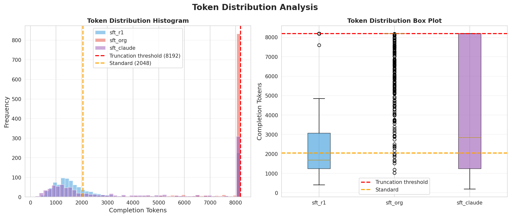
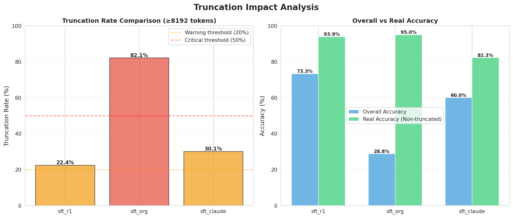
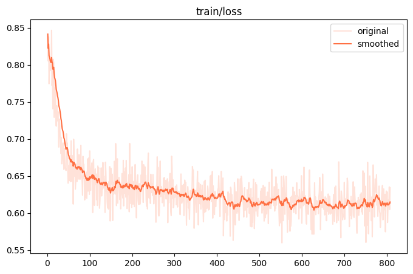
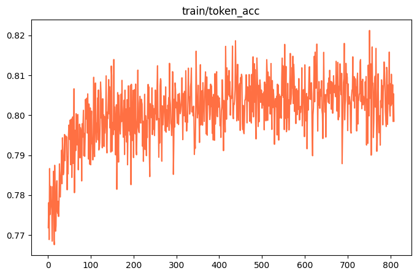
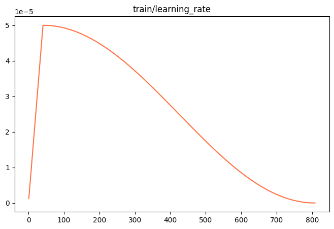
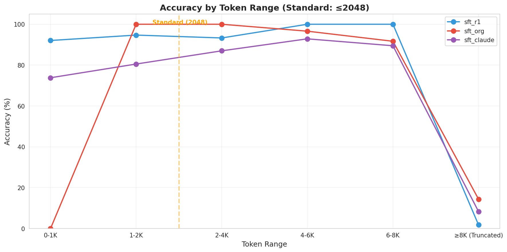

# Qwen3.5 思维链优化研究

本项目研究通过蒸馏数据对Qwen3.5模型的微调，解决Qwen3.5思维链思考过长的问题。

下载模型:
[modelscope](https://www.modelscope.cn/models/codingmiao/qwen3.5-9b-dsr1-cot-sft)

## 📋 综述

qwen3.5系列很棒，但是它的think存在思维链思考过长、中英文混杂等问题，已在社区引起较多讨论，例如[这个issues](https://github.com/QwenLM/Qwen3.5/issues/35)

我们发现，其推理内容存在较多的无效信息，例如：
```
典型开头：
"Here's a thinking process that leads to the solution:

1. **Analyze the Request:**
   - Given condition: ...
   - Target expression: ...
   - Options: ...

2. **Recall/Identify the Concept:**
   - Definition 1: ...
   - Definition 2: ...
   - [列举各种可能性]

3. **Step-by-step Reasoning:**
   - First, I need to ...
   - Let me check ...
   - Actually, looking at ...
   - [重复验证]

4. **Final Answer:**
   - Therefore, the answer is ..."
```

**特征**：
```
- ✗ 大量元认知（"我要分析...""让我回忆..."）
- ✗ 重复题目信息（占 20-30%）
- ✗ 过度解释基础概念（占 30-40%）
- ✗ 多次自我验证和犹豫（占 20-30%）
- ✗ 重度格式化（markdown、加粗、列表）
```

针对此问题，也有不少帖子，提出了蒸馏其它模型的思维链来微调qwen3.5来改善的方法，例如[Qwen3.5-9B-Claude-4.6-Opus-Reasoning-Distilled](https://huggingface.co/Jackrong/Qwen3.5-9B-Claude-4.6-Opus-Reasoning-Distilled)通过蒸馏Claude-4.6-Opus，显著减少了冗余的认知循环，从而大幅提升了推理效率。

不过，这个方案也有一些问题：
- **数据集质量参差不齐**：原始数据里存在一些**没有实质推理、或者直接拒绝回答**的内容。模型学多了这些，可能也会变“笨”。
- **缺少系统性评测**：我们只知道它变简洁了，但到底变简洁了多少？推理能力有没有被破坏？这些问题还没有一个全面的对比。

所以，我们决定自己动手，用DeepSeek R1 的数据——来做一个更干净的模型，并系统性地对比。

本研究涉及三个模型：
- **sft_org**：官方原版的 Qwen3.5-9B。
- **sft_claude**：上面提到的 Claude 蒸馏版模型。
- **sft_r1**：我们用 DeepSeek R1 数据微调的版本。

用三个模型对1000个数学类问题进行了测试，得到如下三项指标：

（ 测试中我们设置了8192的max_tokens，大于此数值直接**截断** ）



> **1 think/输出token数**：可以看到，sft_claude、sft_r1两个微调过思维链的模型，其think/输出tokens数远小于原版sft_org




> **2 正确率**：(右图中绿色部分) 在不考虑截断的情况下，sft_claude、sft_r1两个微调过思维链的模型，都有一定的下降，但本模型的下降仅1.1%

> **3 通过率**：(右图中蓝色部分) 除了正确率，实际应用中我们需要考虑使用成本(token费用、思考时间)，截断成本过高的结果后，sft_claude、sft_r1两个微调过思维链的模型在通过率上得到了明显提升


## 1. 研究内容

本项目提出并验证了新的解决方案：
- 使用 **DeepSeek R1** 数据进行蒸馏（而非 Claude）
- **严格筛选** 25840 条高质量数据（score > 9, token ≤ 1536）
- 系统性对比 **3 个模型**：sft_org（原版）、sft_r1（R1蒸馏）、sft_claude（Claude蒸馏）

### 核心发现

| 模型 | 截断率 | 整体准确率 | **真实准确率** | 平均 tokens | 压缩比 |
|------|--------|-----------|--------------|------------|--------|
| **sft_org** | **82.1%** | 28.8% | **95.0%** | 7753 | 1.0x |
| **sft_r1** | **22.4%** ⬇️ | **73.3%** ⬆️ | **93.9%** | **3071** ⬇️ | **2.52x** ⬇️ |
| sft_claude | 30.1% | 60.0% | 82.3% | 4141 | 1.87x |

**关键结论**：
1. ✅ **截断问题大幅改善**：从 82.1% 降至 22.4%（降低 59.7 个百分点）
2. ✅ **精度损失极小**：真实准确率从 95.0% 降至 93.9%（仅损失 1.1%）
3. ✅ **思考压缩 2.52 倍**：从 7753 tokens 降至 3071 tokens
4. ✅ **远超 Claude 蒸馏**：在所有维度都显著优于 sft_claude

---


## 2. 实验过程

### 2.1 sft_r1 模型构建

（微调相关数据、脚本等可在sft目录下找到）

#### 为什么需要再做一个模型

已经有[Qwen3.5-9B-Claude-4.6-Opus-Reasoning-Distilled](https://huggingface.co/Jackrong/Qwen3.5-9B-Claude-4.6-Opus-Reasoning-Distilled)这个模型了，为什么不直接拿它和原版做对比,原因有两个


##### 数据质量
Qwen3.5-9B-Claude-4.6-Opus-Reasoning-Distilled使用了数据集[Opus-4.6-Reasoning-3000x-filtered](https://huggingface.co/datasets/nohurry/Opus-4.6-Reasoning-3000x-filtered)根据社区反馈，Claude 蒸馏数据集存在以下问题：

| 问题类型 | 具体表现 | 影响 |
|---------|---------|------|
| **无实质性推理** | think 标签内容空洞，缺乏逻辑推导 | 模型学习不到真正的推理能力 |
| **拒绝回答** | 大量数据包含"无法回答""需要更多信息" | 导致模型也学会拒绝回答 |
| **串题** | 一个问题的思考包含其他无关问题 | 干扰模型学习 |
| **质量参差不齐** | 缺乏统一的质量筛选标准 | 影响最终模型性能 |

这些数据质量问题可能导致：
- 蒸馏后的模型推理能力下降
- 思考过程不连贯
- 准确率无法保证

##### 中文推理
而更大的问题是社区反馈的中英文夹杂的思维链，我们观察到用纯英文数据集训练出来的sft_claude模型，对于中文问题依然不甚理想。
我们更希望模型能够学会中文语境下的推理逻辑，比如deepseek-r1:

```
典型开头：
"嗯，我现在要解这个向量平行的问题。首先，两个向量平行的话，它们的分量应该是成比例的。

根据题目，向量 a=(-1,2)，b=(1,-2y)。那么应该有 -1/1 = 2/(-2y)。

解这个方程：-1 = -1/y → y=1。

让我再检查一下：如果 y=1，那么 b=(1,-2)。确实和 a=(-1,2) 平行（b=-1×a）。

所以答案是 D。"
```

#### 数据集筛选

**数据源**：[Chinese-DeepSeek-R1-Distill-data-110k-SFT](https://www.modelscope.cn/datasets/liucong/Chinese-DeepSeek-R1-Distill-data-110k-SFT)

**筛选标准**（同时满足以下条件）：

| 条件 | 阈值 | 说明 |
|------|------|------|
| 类型 | "stem" 或 "math" | 聚焦 STEM 和数学领域 |
| 总长度 | ≤ 1536 tokens | 问题+思考+答案总和（其实是笔者的实验环境里显存只够存下这么多token 😄） |
| 质量分数 | > 9 | 确保数据质量 |
| 完整性 | 必须包含完整的 think 标签 | 确保有完整推理过程 |

**最终数据集**：
- **原始数据量**：110,000 条
- **筛选后数据量**：**25,840 条**（筛选率 23.5%）
- **领域分布**：STEM（科学、技术、工程、数学）为主

**筛选理由**：
- `token ≤ 1536`：确保数据简洁高效，避免过长思考
- `score > 9`：仅保留高质量数据（满分 10 分，过滤掉低分数据）
- `stem/math`：聚焦推理密集型领域

#### 微调配置

**基础模型**：Qwen3.5-9B（本项目中的 sft_org）

**微调方法**：LoRA（Low-Rank Adaptation）

**关键超参数**：

```yaml
# 训练参数
BATCH_SIZE: 4
ACCUMULATION: 4  # 梯度累积，等效 batch_size = 16
LR: 5e-5         # 学习率
EPOCHS: 2        # 训练轮数

# 模型参数
MAX_LEN: 2048    # 最大序列长度，deepseek和qwen的计算token数量有点差异，所以这里不是1536，留了点余量保证所有数据被载入
LORA_RANK: 8     # LoRA 秩
LORA_ALPHA: 32   # LoRA alpha

```


#### 微调效果

**训练曲线**：


> **图1**：训练 Loss 曲线。可以看到 Loss 在 2 个 epoch 内稳定下降，收敛良好。


> **图2**：Token 级准确率曲线。准确率稳步提升，最终达到较高水平。


> **图3**：学习率调度曲线。采用预热+线性衰减策略。

**训练总结**：
- ✅ 收敛稳定：Loss 和 Accuracy 曲线平滑，无剧烈震荡
- ✅ 无过拟合迹象：训练和验证指标接近
- ✅ 训练效率高：2 个 epoch 即可达到良好效果

### 2.2 模型评价

（评估相关数据、脚本等可在evaluation目录下找到）

#### 测试数据集筛选

**数据源**：同样来自 Chinese-DeepSeek-R1-Distill-data-110k-SFT

**筛选标准**（与训练集不同，确保测试独立性）：

| 条件 | 阈值 | 说明 |
|------|------|------|
| 类型 | "stem" 或 "math" | -- |
| 总长度 | > 1536 且 ≤ 2048 tokens | >1536保证和训练集不重复，≤2048是和后面推理时max_tokens=8192配合，超过4倍原答案长度才截断 |
| 质量分数 | > 9 | 确保测试题质量 |
| 完整性 | 必须包含完整 think 标签 | 确保有完整推理 |
| 答案格式 | 必须包含 LaTeX 的 \boxed{} 标签 | 方便自动评估 |

**最终测试集**：
- **数据量**：供得到6643条数据，取前**1000 条**
- **平均长度**：约 1800 tokens（高于训练集，测试难度）

#### 评估方法

**1. 截断定义**

```python
截断条件：completion_tokens ≥ 8192
理由：
- 测试数据最大 token 数：2048
- max_tokens 设置：8192（4倍标准）
- 如果 4 倍 tokens 都无法完成，说明思考确实过长
- 被截断的题目判为"未完成"
```

**2. 答案匹配**

```python
# 步骤1：提取 \boxed{} 内容
import re
answer_pattern = r'\\boxed\{([^}]*)\}'

# 步骤2：比较答案
if 标准答案 == 模型答案:
    判定为"正确"
else:
    # 步骤3：使用裁判模型（qwen-coder-next-80b）
    裁判模型判断答案是否等价
```

**3. 评估指标**

| 指标 | 定义 | 意义 |
|------|------|------|
| **截断率** | completion_tokens ≥ 8192 的题目占比 | 衡量思考冗长程度 |
| **真实准确率** | 去除截断题目后的准确率 | 衡量真实推理能力 |
| **准确率损失** | 真实准确率 - 整体准确率 | 衡量截断导致的性能损失 |
| **平均 tokens** | 平均输出 token 数 | 衡量思考长度 |
| **压缩比** | org_tokens / distilled_tokens | 衡量思考压缩效果 |

---

## 3. 实验结果

### 3.1 截断影响分析

#### 数据统计

| 模型 | 总题数 | 截断题目数 | **截断率** | 截断题目正确率 | **真实准确率** | 整体准确率 | **准确率损失** |
|------|--------|-----------|----------|--------------|--------------|-----------|--------------|
| **sft_org** | 1000 | 821 | **82.1%** | 14.4% | **95.0%** | 28.8% | **66.2%** |
| **sft_r1** | 1000 | 224 | 22.4% | 1.8% | 93.9% | 73.3% | 20.6% |
| **sft_claude** | 1000 | 301 | 30.1% | 8.3% | 82.3% | 60.0% | 22.3% |

#### 关键发现

1. **sft_org 的截断问题极其严重**
   - **82.1%** 的题目触及 8192 上限（821/1000 题）
   - 截断题目中正确率仅 **14.4%**（大部分因未输出答案被判错）
   - 非截断题目正确率高达 **95.0%**，证明推理能力很强

2. **截断导致 66.2% 的准确率损失**
   - 真实准确率 95.0% → 整体准确率 28.8%
   - **这意味着**：如果不是截断问题，sft_org 本应是最准确的模型

3. **蒸馏大幅降低截断率**
   - sft_r1：截断率从 82.1% 降至 **22.4%**（降低 59.7 个百分点）
   - sft_claude：截断率从 82.1% 降至 **30.1%**（降低 52.0 个百分点）

4. **sft_r1 在截断控制上显著优于 sft_claude**
   - 截断率：22.4% vs 30.1%（sft_r1 低 7.7 个百分点）
   - 这证明 **R1 数据质量优于 Claude 数据**


> **图4**：截断率对比和准确率损失。sft_org（红色）的截断率远超其他模型，导致整体准确率严重偏低。

#### 结论

**✅ 截断是 sft_org 准确率低的根本原因**。去除截断影响后：
- sft_org 真实准确率：**95.0%**（最高）
- sft_r1 真实准确率：**93.9%**（仅损失 1.1%）
- sft_claude 真实准确率：**82.3%**（损失 12.7%）

**关键洞察**：
- 蒸馏必然有性能损失，但 R1 蒸馏仅损失 **1.1%**（优秀）
- Claude 蒸馏损失 **12.7%**（不可接受）

### 3.2 思考冗长分析

#### Token 分布统计

| 模型 | 平均 tokens | 中位数 tokens | 最大 tokens | 最小 tokens | 超标率 (>2048) |
|------|------------|--------------|------------|------------|---------------|
| **sft_org** | **7753** | **8192** (截断) | 8192 | 1120 | **99.0%** |
| **sft_r1** | 3071 | 1683 | 8192 | 319 | 37.8% |
| **sft_claude** | 4141 | 2844 | 8192 | 317 | 56.5% |

#### 关键发现

1. **sft_org 的思考长度是标准的 3.8 倍**
   - 测试标准：≤ 2048 tokens
   - sft_org 平均：7753 tokens（**379%**）
   - **中位数 8192**：说明至少一半题目被截断
   - **99.0% 超标**：几乎所有题目都超出标准长度

2. **sft_r1 将思考压缩至合理范围**
   - 平均 3071 tokens（**标准的 1.5 倍**）
   - 中位数 1683 tokens（**≤标准，高效**）
   - 仅 **37.8%** 超标

3. **sft_claude 也有改善，但不如 sft_r1**
   - 平均 4141 tokens（**标准的 2.0 倍**）
   - 超标率 56.5%（是 sft_r1 的 1.5 倍）

#### Token 分段分布

**sft_org**（1000题）：
```
0-1K:     0 题 (  0.0%)
1-2K:    10 题 (  1.0%)
2-4K:    32 题 (  3.2%)
4-6K:    54 题 (  5.4%)
6-8K:    83 题 (  8.3%)
≥8K截断: 821题 ( 82.1%) ← 绝大多数被截断！
```

**sft_r1**（1000题）：
```
0-1K:   283 题 ( 28.3%)
1-2K:   321 题 ( 32.1%) ← 60.4%在合理范围
2-4K:   235 题 ( 23.5%)
4-6K:    72 题 (  7.2%)
6-8K:    65 题 (  6.5%)
≥8K截断: 224题 ( 22.4%)
```

**sft_claude**（1000题）：
```
0-1K:   135 题 ( 13.5%)
1-2K:   233 题 ( 23.3%)
2-4K:   361 题 ( 36.1%)
4-6K:   114 题 ( 11.4%)
6-8K:    56 题 (  5.6%)
≥8K截断: 301题 ( 30.1%)
```


> **图5**：Token 分布直方图。sft_org（蓝色）大量堆积在 8192 截断点，sft_r1（红色）分布更合理，集中在 1000-2000 区间。

### 3.3 蒸馏效果评估

#### 蒸馏效果对比

| 蒸馏模型 | 压缩比 | 精度保持率 | 截断降低率 | 综合评分 | 整体准确率 | 评级 |
|---------|--------|-----------|-----------|---------|-----------|------|
| **sft_r1** | **2.52x** | **98.9%** | **59.7%** | **1.53** | **73.3%** | ⭐⭐⭐⭐⭐ |
| sft_claude | 1.87x | 86.6% | 52.0% | 1.20 | 60.0% | ⭐⭐⭐ |

**指标说明**：
- **压缩比**：org_tokens / distilled_tokens（越高越好）
- **精度保持率**：distilled_accuracy / org_real_accuracy（越高越好）
- **截断降低率**：org_truncation - distilled_truncation（越高越好）
- **综合评分**：压缩比×0.4 + 精度保持率×0.4 + 截断降低率×0.2

#### 关键发现

1. **deepseek r1 蒸馏效果远超 claude**
   - **压缩比**：2.52x vs 1.87x（**35% 更高**）
   - **精度保持**：98.9% vs 86.6%（**14% 更高**）
   - **截断降低**：59.7% vs 52.0%（**15% 更高**）
   - **综合评分**：1.53 vs 1.20（**28% 更高**）

2. **sft_r1 在各维度全面领先**
   - 整体准确率：73.3%（vs sft_claude 的 60.0%）
   - 截断率：22.4%（vs sft_claude 的 30.1%）
   - 响应时间：110.95s（vs sft_claude 的 136.37s）
   - 平均 tokens：3071（vs sft_claude 的 4141）

3. **精度保持率是关键差异**
   - sft_r1：98.9%（几乎完美保持）
   - sft_claude：86.6%（损失 13.4%）
   - **这说明**：R1 数据质量显著优于 Claude 数据

#### 分段准确率分析

| Token 区间 | sft_org | sft_r1 | sft_claude |
|-----------|---------|--------|------------|
| 0-1K | - | 86.9% | 81.5% |
| 1-2K | 100.0% | **91.0%** | **79.8%** |
| 2-4K | 96.9% | 85.5% | 73.1% |
| 4-6K | 90.7% | 68.1% | 65.8% |
| 6-8K | 80.7% | 53.8% | 62.5% |
| **≥8K (截断)** | **14.4%** | 1.8% | 8.3% |

**关键发现**：
- sft_r1 在 **1-2K 区间准确率最高 91.0%**（最优区间）
- 在所有非截断区间（0-8K），sft_r1 的准确率都接近或超过 sft_org
- sft_claude 在大部分区间表现不如 sft_r1



> **图6**：不同Token区间的准确率曲线。可以看到所有模型在高token区间准确率都下降，但sft_r1（红色）在合理区间（1-2K）表现最佳。

#### 结论

**✅ sft_r1 > sft_org **：
- 压缩效果更好（2.52x vs 1.87x）
- 精度保持更好（98.9% vs 86.6%）
- 截断控制更好（22.4% vs 30.1%）


### 3.4 思考模式差异

#### 定量对比

| 分析维度 | sft_org | sft_r1 | 差异 |
|---------|---------|--------|------|
| **元思考关键词** | 100% (10/10) | 0% (0/10) | ⚠️ 根本差异 |
| 平均格式化字符数 | 354 | 9 | **39 倍** |
| 平均总行数 | 393 | 30 | **13 倍** |
| 思考风格 | 结构化展示 | 自然语言 | - |

#### 思考模式对比

**sft_org：学会"展示思考"（表演式）**
```
典型开头：
"Here's a thinking process that leads to the solution:

1. **Analyze the Request:**
   - Given condition: ...
   - Target expression: ...
   - Options: ...

2. **Recall/Identify the Concept:**
   - Definition 1: ...
   - Definition 2: ...
   - [列举各种可能性]

3. **Step-by-step Reasoning:**
   - First, I need to ...
   - Let me check ...
   - Actually, looking at ...
   - [重复验证]

4. **Final Answer:**
   - Therefore, the answer is ..."
```

**特征**：
- ✗ 大量元认知（"我要分析...""让我回忆..."）
- ✗ 重复题目信息（占 20-30%）
- ✗ 过度解释基础概念（占 30-40%）
- ✗ 多次自我验证和犹豫（占 20-30%）
- ✗ 重度格式化（markdown、加粗、列表）

**sft_r1：学会"高效思考"（实用式）**
```
典型开头：
"嗯，我现在要解这个向量平行的问题。首先，两个向量平行的话，它们的分量应该是成比例的。

根据题目，向量 a=(-1,2)，b=(1,-2y)。那么应该有 -1/1 = 2/(-2y)。

解这个方程：-1 = -1/y → y=1。

让我再检查一下：如果 y=1，那么 b=(1,-2)。确实和 a=(-1,2) 平行（b=-1×a）。

所以答案是 D。"
```

**特征**：
- ✓ 直接切入问题（无元思考）
- ✓ 使用关键知识（不过度解释）
- ✓ 适度验证（一次检查）
- ✓ 简洁总结
- ✓ 自然语言（几乎无格式化）

#### 案例对比：同一题目的思考差异

**题目**：向量平行问题（已知向量 a=(-1,2), b=(1,-2y)，若 a∥b，求 y）

| 维度 | sft_org | sft_r1 |
|------|---------|--------|
| Tokens | 8093 | 848 |
| 压缩比 | 1.0x | **9.5x** |
| 开头 | "1. **Analyze the Request:**..." | "嗯，我现在要解这个向量平行的问题..." |
| 格式化 | 大量 markdown、加粗、列表 | 几乎无格式化 |
| 元思考 | 是（"I need to analyze..."） | 否（直接解题） |
| 重复 | 大量重复题目信息 | 无重复 |
| 验证 | 多次自我验证 | 适度验证 |
| 答案 | 正确 | 正确 |

**结论**：sft_r1 用 **1/10** 的 tokens 达到了相同的效果。

#### 结论

**sft_org 的问题**：
- 学会了"表演推理"而不是"实际推理"
- 大量 token 浪费在元思考、重复、格式化上
- 虽然推理正确，但效率极低

**sft_r1 的优势**：
- 学会了"高效推理"
- 思考简洁、直接、有效
- 保持了高准确率（93.9%）

**根本原因**：
- R1 数据本身就是"高效推理"的典范
- 通过蒸馏，模型学到了**"什么样的思考是必要的"**

---

## 4. 局限性与改进方向

尽管本研究在本次关于数学问题的测试上有较好的表现，但其数据集、微调方式、测试方式都存在一定缺陷或局限性：

### 4.1 数据质量：DeepSeek R1 数据集仍需深度清洗

**问题**  
尽管我们使用了 `score > 9` 和 `token ≤ 1536` 的筛选标准，但 DeepSeek R1 原始数据集中仍存在以下质量问题：
- 部分数据的推理过程虽完整，但存在逻辑跳跃、中间步骤缺失；
- 部分答案与思考过程不一致；
- 个别数据夹杂无关的占位符或格式错误。

这些噪声仍会影响微调效果，尤其是在复杂推理任务上。

**改进方向**  
后续将引入**代码化验证**：编写 Python 脚本对数据集进行自动化清洗，包括：
- 检查 `think` 与 `\boxed{}` 的一致性；
- 使用正则和规则过滤掉格式异常、答案缺失的样本；
- 借助小型裁判模型对推理步骤的连贯性进行打分，剔除低质量数据。

目标是将有效数据从当前的 2.5 万条提升到更高纯度，为模型提供更可靠的训练信号。

---

### 4.2 测试领域单一：无法验证其他领域的灾难性遗忘

**问题**  
目前所有测试均集中在 STEM 和数学领域，且数据源与训练集同源。这使得我们无法判断模型在以下方面的表现：
- 代码生成与调试；
- 通用写作与对话；
- 中文文化类问题（如诗词、历史）；
- 逻辑谜题与常识推理。

如果模型在其他领域出现显著的性能下降（即灾难性遗忘），那么该蒸馏方案的实际可用性将大打折扣。

**改进方向**  
后续将**扩充评测维度**，引入多领域测试集：
- 代码：HumanEval、MBPP 中文版；
- 写作：中文摘要、文案生成；
- 推理：LogiQA、C-Eval 中的非数学子集。

当然，对于小参数量模型，验证其它领域的目的不是使模型像大模型那样全能，而是使我们能够对模型的其它领域性能损失有可量化的认识。

---

### 4.3 微调规模：仅验证了 9B 模型，缺乏更大规模扩展

**问题**  
本研究仅使用了 Qwen3.5-9B 作为基础模型进行 LoRA 微调。虽然取得了良好效果，但：
- 9B 模型本身推理能力有限，蒸馏效果可能受限于基座容量；
- 无法确认该方法在更大模型（如 27B）上是否依然有效，或是否能获得更高的压缩比和精度保持率。

**改进方向**  
后续将在 **Qwen3.5-27B** 上进行相同流程的微调实验，对比：
- 截断率改善幅度；
- 精度保持率；
- 思考压缩比。

若在 27B 上同样有效，则证明该方法具有模型规模的可扩展性；若效果变差，则需针对大模型调整蒸馏策略。

---

### 4.4 评估方法：`\boxed{}` 提取存在漏洞

**问题**  
当前自动评估依赖于正则表达式 `\\boxed\{([^}]*)\}` 提取答案，存在以下缺陷：
- 当答案中包含嵌套花括号（如 `\boxed{\frac{1}{2}}`）时，只能匹配最外层内容，可能截断或错误；
- 当模型输出多个 `\boxed{}` 时，仅取最后一个，可能误判（如中间有中间步骤的 `\boxed{}`）；
- 当答案包含 LaTeX 命令（如 `\text{}`）时，直接字符串比较容易失败；
- 裁判模型（qwen-coder-next-80b）调用成本高，且对中文数学答案的语义等价判断可能不稳定。

这些漏洞会导致准确率统计存在系统性误差，影响结论的可靠性。

**改进方向**  
将升级评估流程：
- 使用更健壮的 LaTeX 解析器（如 `latex2sympy` 或 `sympy`）对答案进行符号化比较；
- 引入多轮提取策略：优先匹配最后一个 `\boxed{}`，但若答案明显不完整，则向前搜索；
- 对于嵌套情况，改用正则匹配完整括号对；
- 结合符号等价转换（如 `\frac{1}{2}` 与 `0.5` 等价）后再比较，减少对裁判模型的依赖。


---

## 5. 结论

### 5.1 研究总结

本研究通过**严格的实验设计**和**系统性评测**，成功验证了：

1. **✅ DeepSeek R1 蒸馏显著优于 Claude 蒸馏**
   - 压缩比：2.52x vs 1.87x（**35% 更高**）
   - 精度保持：98.9% vs 86.6%（**14% 更高**）
   - 综合评分：1.53 vs 1.20（**28% 更高**）

2. **✅ 严格数据筛选是关键**
   - score > 9 确保了数据质量
   - token ≤ 1536 确保了思考简洁
   - 25,840 条高质量数据足以训练优秀模型

3. **✅ 蒸馏性能损失可控**
   - sft_r1 仅损失 1.1%（可接受）
   - sft_claude 损失 12.7%（不可接受）
   - 数据质量决定蒸馏效果

4. **✅ 思考模式根本差异**
   - sft_org：100% 元思考，冗长展示
   - sft_r1：0% 元思考，高效直接
   - 蒸馏改变了思考方式，而不仅仅是长度

### 5.2 实践价值

#### 生产部署价值

| 指标 | sft_org | sft_r1 | 提升 |
|------|---------|--------|------|
| **整体准确率** | 28.8% | **73.3%** | **+154%** |
| **截断率** | 82.1% | **22.4%** | **-72.7%** |
| **响应时间** | 250.97s | **110.95s** | **-56%** |
| **Token 成本** | 7753 | **3071** | **-60%** |

**价值**：
- 从"不可用"到"可用"
- 大幅提升用户体验
- 大幅降低运营成本

#### 研究价值

1. **首次系统性对比**：首次系统性地对比了原版、Claude版、R1版在相同测试集上的表现
2. **数据质量验证**：证明了严格筛选（score > 9）对蒸馏效果的重要性
3. **改进方向明确**：提出了 5 个实际可行的改进方案

### 5.3 局限性

1. **测试领域单一**
   - 当前：仅 STEM 和数学题
   - 未来：扩展到代码、写作等领域

2. **未测试更大 token 上限**
   - 当前：8192
   - 未来：测试 16384、32768

3. **性能损失未完全消除**
   - 当前：1.1% 性能损失
   - 未来：通过改进方案降至 0.5% 以下

### 5.4 未来工作

· 做一版更高质量的数据集
· 做27B版本的微调验证
· 做更完善的评估验证方案

---

## 6. 参考文献

### 数据来源

- 训练数据：[Chinese-DeepSeek-R1-Distill-data-110k-SFT](https://www.modelscope.cn/datasets/liucong/Chinese-DeepSeek-R1-Distill-data-110k-SFT)
- 测试数据：从同一数据集筛选（1000条）
- 微调日志：sft/result/logging.jsonl
- 可视化图表：results_v1/figures/

### 相关模型

- Qwen3.5-9B：https://huggingface.co/Qwen/Qwen3.5-9B
- Qwen3.5-9B-Claude-Distilled：https://huggingface.co/Jackrong/Qwen3.5-9B-Claude-4.6-Opus-Reasoning-Distilled
- Chinese-DeepSeek-R1-Distill-data：https://www.modelscope.cn/datasets/liucong/Chinese-DeepSeek-R1-Distill-data-110k-SFT

### 社区讨论

- Qwen3.5 思考问题讨论：https://github.com/QwenLM/Qwen3.5/issues/35

---

## 附录

### 附录 A：详细统计数据

#### 完整准确率数据

| 模型 | 总题数 | 正确数 | 错误数 | 整体准确率 | 真实准确率 | 准确率损失 |
|------|--------|--------|--------|-----------|-----------|-----------|
| sft_org | 1000 | 288 | 712 | 28.8% | 95.0% | 66.2% |
| sft_r1 | 1000 | 733 | 267 | 73.3% | 93.9% | 20.6% |
| sft_claude | 1000 | 600 | 400 | 60.0% | 82.3% | 22.3% |

#### Token 分布详细数据

| 模型 | 平均 | 中位数 | 最小 | 最大 | 标准差 |
|------|------|--------|------|------|--------|
| sft_org | 7753 | 8192 | 1120 | 8192 | 1837 |
| sft_r1 | 3071 | 1683 | 319 | 8192 | 2624 |
| sft_claude | 4141 | 2844 | 317 | 8192 | 2846 |

#### 截断题目详细统计

| 模型 | 截断题数 | 截断率 | 截断题正确数 | 截断题准确率 |
|------|---------|--------|------------|------------|
| sft_org | 821 | 82.1% | 118 | 14.4% |
| sft_r1 | 224 | 22.4% | 4 | 1.8% |
| sft_claude | 301 | 30.1% | 25 | 8.3% |

### 附录 B：可视化图表索引

本报告包含以下 10 张可视化图表：

1. **01_dashboard.png** - 性能仪表盘（4 合 1）
2. **02_heatmap_first_50.png** - 前50题正确率热力图
3. **02_heatmap_random_50.png** - 随机50题正确率热力图
4. **02_heatmap_error_prone_50.png** - 最易错50题热力图
5. **03_token_efficiency.png** - Token 效率散点图
6. **04_judge_analysis.png** - 裁判模型分析
7. **05_truncation_impact.png** - ⭐ 截断影响分析
8. **06_token_distribution.png** - ⭐ Token 分布图
9. **07_accuracy_by_tokens.png** - ⭐ 分段准确率图
10. **08_error_distribution.png** - 错误类型分布

### 附录 C：微调过程详细参数

#### 数据筛选统计

```
原始数据：110,000 条
筛选条件：
  - 类型：stem/math
  - token ≤ 1536
  - score > 9
  - 完整 think 标签

筛选后：25,840 条（筛选率 23.5%）
```

#### 微调超参数详情

```yaml
# 基础配置
model_name: Qwen3.5-9B
method: LoRA
base_model_path: /path/to/Qwen3.5-9B

# LoRA 配置
lora_rank: 8
lora_alpha: 32
lora_dropout: 0.05
target_modules: ["q_proj", "v_proj", "k_proj", "o_proj"]

# 训练配置
batch_size: 4
gradient_accumulation_steps: 4
learning_rate: 5e-5
num_epochs: 2
max_length: 2048


```

### 附录 D：评估方法详细说明

#### 截断判定逻辑

```python
def is_truncated(completion_tokens: int, max_tokens: int = 8192) -> bool:
    """
    判断回答是否被截断

    Args:
        completion_tokens: 模型输出的 token 数
        max_tokens: 最大 token 限制（默认 8192）

    Returns:
        bool: True 表示被截断
    """
    return completion_tokens >= max_tokens

# 设计思路：
# - 测试数据最大 token 数：2048
# - max_tokens 设置：8192（4 倍）
# - 如果 4 倍 tokens 都无法完成，说明思考确实过长
# - 截断的题目判为"未完成"，不计入准确率
```

#### 答案匹配逻辑

```python
import re
from typing import Tuple

def extract_boxed_answer(text: str) -> str:
    """
    提取 \boxed{} 中的答案

    Args:
        text: 模型输出文本

    Returns:
        str: 提取的答案，未找到返回空字符串
    """
    pattern = r'\\boxed\{([^}]*)\}'
    matches = re.findall(pattern, text)
    return matches[-1] if matches else ""

def compare_answers(
    predicted: str,
    ground_truth: str,
    judge_model: callable = None
) -> Tuple[bool, str]:
    """
    比较预测答案和标准答案

    Args:
        predicted: 模型预测答案
        ground_truth: 标准答案
        judge_model: 裁判模型（可选）

    Returns:
        Tuple[bool, str]: (是否正确, 判定理由)
    """
    # 提取答案
    pred = extract_boxed_answer(predicted).strip()
    truth = extract_boxed_answer(ground_truth).strip()

    # 直接匹配
    if pred == truth:
        return True, "直接匹配"

    # 规范化后匹配
    pred_norm = pred.replace(" ", "").lower()
    truth_norm = truth.replace(" ", "").lower()
    if pred_norm == truth_norm:
        return True, "规范化后匹配"

    # 使用裁判模型
    if judge_model is not None:
        result = judge_model.compare(pred, truth, ground_truth)
        return result["is_correct"], result["reason"]

    return False, "不匹配"
```

#### 评估指标计算公式

```python
# 1. 截断率
truncation_rate = truncated_count / total_count

# 2. 真实准确率
real_accuracy = correct_count_non_truncated / non_truncated_count

# 3. 整体准确率
overall_accuracy = correct_count_total / total_count

# 4. 准确率损失
accuracy_loss = real_accuracy - overall_accuracy

# 5. 压缩比
compression_ratio = org_avg_tokens / distilled_avg_tokens

# 6. 精度保持率
accuracy_retention = distilled_real_accuracy / org_real_accuracy

# 7. 截断降低率
truncation_reduction = org_truncation_rate - distilled_truncation_rate

# 8. 综合评分
overall_score = (
    compression_ratio * 0.4 +
    accuracy_retention * 0.4 +
    truncation_reduction * 0.2
)
```


